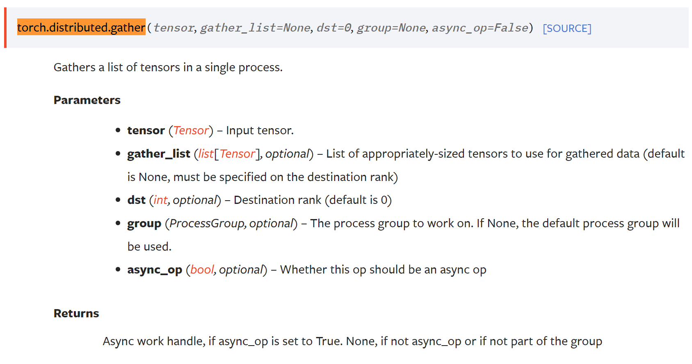

# Background Knowledge
## torch.distributed.gather


# Main API
## deepspeed.init_distributed
### cdb 
- deepspeed communnication backend
### 初始化cdb
``` python
if cdb is None:
    init_deepspeed_backend(get_accelerator().communication_backend_name(), timeout, init_method)
    set_backend()
    utils.logger.info(f'cdb={cdb}')
if cdb is None and torch.distributed.is_initialized():
    # The user initialized torch.dist themselves, create cdb and short-circuit
    cdb = TorchBackend(dist_backend, timeout, init_method)
    return
```

## 生成loss、opt，加载model权重

## deepspeed.initialize
``` python
model, optimizer, _, _ = deepspeed.initialize(
    model = model,
    optimizer = optimizer,
    args = args,
    lr_scheduler = None,#scheduler,
    dist_init_required=True
    )
```
### Model Engine
``` python
    if not isinstance(model, PipelineModule):
        config_class = DeepSpeedConfig(config, mpu)
        if config_class.hybrid_engine.enabled:
            engine = DeepSpeedHybridEngine(args=args,
                                           model=model,
                                           optimizer=optimizer,
                                           model_parameters=model_parameters,
                                           training_data=training_data,
                                           lr_scheduler=lr_scheduler,
                                           mpu=mpu,
                                           dist_init_required=dist_init_required,
                                           collate_fn=collate_fn,
                                           config=config,
                                           config_class=config_class)
        else:
            engine = DeepSpeedEngine(args=args,
                                     model=model,
                                     optimizer=optimizer,
                                     model_parameters=model_parameters,
                                     training_data=training_data,
                                     lr_scheduler=lr_scheduler,
                                     mpu=mpu,
                                     dist_init_required=dist_init_required,
                                     collate_fn=collate_fn,
                                     config=config,
                                     config_class=config_class)
    else:
        assert mpu is None, "mpu must be None with pipeline parallelism"
        mpu = model.mpu()
        config_class = DeepSpeedConfig(config, mpu)
        engine = PipelineEngine(args=args,
                                model=model,
                                optimizer=optimizer,
                                model_parameters=model_parameters,
                                training_data=training_data,
                                lr_scheduler=lr_scheduler,
                                mpu=mpu,
                                dist_init_required=dist_init_required,
                                collate_fn=collate_fn,
                                config=config,
                                config_class=config_class)
```

### Train
- 一般的torch模型训练

# DeepSpeedEngine
## 
## DeepSpeedCPUAdam
