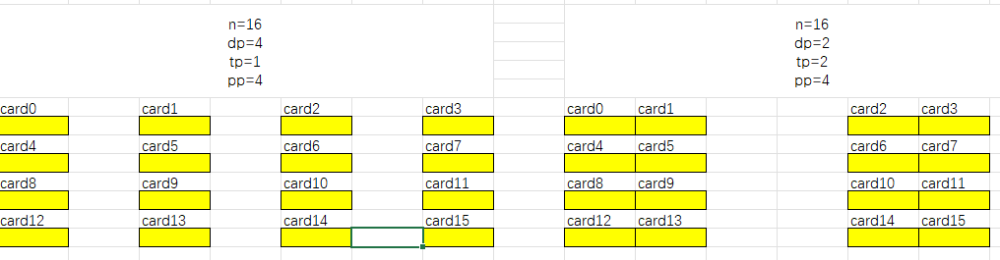
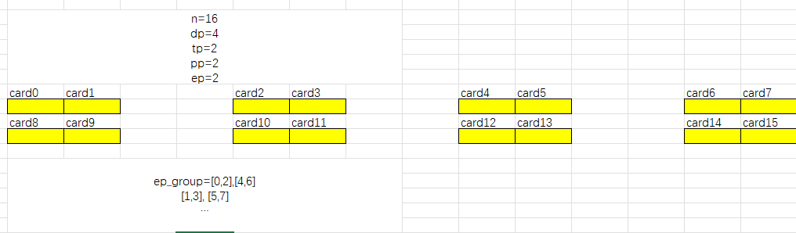

# 入口
```python
deepspeed.__init__.py
```
## 1. 获取通信名称，一般为nccl
```python
dist_backend = get_accelerator().communication_backend_name()
```
### 1.1. 获取accelerator类型
```python
accelerator.realaccelerator.py 里的
get_accelerator()
```
### 1.2. 跟据1.1的accelerator获取通信后端
```python
# 此处以GPU为例
ds_accelerator = CUDA_Accelerator()
# 返回通信后端
def communication_backend_name(self):
    # self._communication_backend_name = 'nccl'
    return self._communication_backend_name
```
# 2. 创建通信
```python
dist.init_distributed(dist_backend=dist_backend,
                      distributed_port=distributed_port,
                      dist_init_required=dist_init_required)
```
## 2.1. 初始化cdb
1. 如果为nccl，init_deepspeed_backend此步只是简单的打印日志；
2. set_backend，设置cdb，但此时nccl_backend仍为None，需要走TorchBackend；
```python
if cdb is None:
    init_deepspeed_backend(get_accelerator().communication_backend_name(), timeout, init_method)
    set_backend()
    utils.logger.info(f'cdb={cdb}')
...
cdb = TorchBackend(dist_backend, timeout, init_method, rank, world_size)
```
3. 初始化TorchBackend的部分function
```python
# deepspeed.comm.torch.py
self.shm_comm_op = build_shm_op()
self.has_all_reduce_coalesced = has_all_reduce_coalesced()
self.has_coalescing_manager = has_coalescing_manager()
self.all_gather_function = self.get_all_gather_function()
self.reduce_scatter_function = self.get_reduce_scatter_function()
```
4. 初始化通信进程组
```python
self.init_process_group(backend, timeout, init_method, rank, world_size)
```
```
torch.distributed.init_process_group(backend,
                                        timeout=timeout,
                                        init_method=init_method,
                                        rank=rank,
                                        world_size=world_size)
```

<font color="red">megatron mpu是什么</font>


# 3. Engine类，提供opt、dataloader、lr_scheduler
## 1. 返回的信息
```python
    return_items = [engine, engine.optimizer, engine.training_dataloader, engine.lr_scheduler]
    return tuple(return_items)
```
## 2. 3类引擎
### 2.1. DeepSpeedEngine
#### 2.1.1. 创建config类
```python
config_class = DeepSpeedConfig(config, mpu)
```
1. 初始化rank相关参数
```python
self.global_rank = dist.get_rank()
...
if mpu is None:
    self.world_size = dist.get_world_size()
else:
    self.world_size = mpu.get_data_parallel_world_size()
```
2. <font color="red">elasticity_enabled 这是干嘛的？</font>

3. 其余训练参数初始化
如bsz、zero_config等
```python
# Pass a copy so that user json is unmodified, e.g. for logging
self._initialize_params(copy.copy(self._param_dict))
self._configure_train_batch_size()
self._do_sanity_check()
```
#### 2.1.2. 创建engine
1. 加载参数
2. check local_rank
3. 判定 opt的fp16支持度、loss_scale支持度、lr_scheduler的类型支持
```python
if self.fp16_enabled() and not get_accelerator().is_fp16_supported():
    raise ValueError("Type fp16 is not supported.")
...
if not self.client_optimizer:
    if self.optimizer_name() is not None:
        assert self._is_supported_optimizer(
            self.optimizer_name()), "{} is not a supported DeepSpeed Optimizer".format(self.optimizer_name())    
...            
# Detect invalid combinations of client optimizer and client scheduler
if isinstance(self.client_lr_scheduler, _LRScheduler):
    assert isinstance(self.client_optimizer, Optimizer), \
        f'Client Optimizer (type = {type(self.client_optimizer)} is not instantiated but Client LR Scheduler is instantiated'                    
```
4. 设置local_rank、world_size、global_rank
```python
self._set_distributed_vars(args)
```
#### 2.1.3. 模型分割
1. 入口
```python
self._configure_distributed_model(model)
``` 
2. 设置zero_stage相关参数、MOE相关group参数
```python
# expert相关parallel
if hasattr(module, 'set_deepspeed_parallelism'):
    module.set_deepspeed_parallelism(self._config.use_data_before_expert_parallel_)
```
   - 1. 创建通信进程组
```python
self._create_process_groups(use_data_before_expert_parallel_=use_data_before_expert_parallel_)
```
- 
     - 获取dp、tp、pp、ep
     - 按rank创建expert parallel group
```python
if group_name not in _EXPERT_DATA_PARALLEL_GROUP and group_name not in _EXPERT_PARALLEL_GROUP:
    expert_parallel_groups, expert_data_parallel_groups = _get_expert_parallel_ranks(
        world_size, tensor_parallel_size_, expert_parallel_size_, pp_world_size, use_data_before_expert_parallel_)
    for ranks in expert_parallel_groups:
        group = dist.new_group(ranks)
        if rank in list(ranks):
            _EXPERT_PARALLEL_GROUP[group_name] = group

    for ranks in expert_data_parallel_groups:
        group = dist.new_group(ranks)
        if rank in list(ranks):
            _EXPERT_DATA_PARALLEL_GROUP[group_name] = group
```
-
  - 
  - expert parallel
  

3. 广播权重参数
```python
self._broadcast_model()
```
#### 2.1.3. 优化器相关
- 是否有moe层
- zero_offload
```python
if client_optimizer is None:
    if self.has_moe_layers:
        model_parameters = configure_moe_param_groups(model_parameters)
    basic_optimizer = self._configure_basic_optimizer(model_parameters)
    log_dist(f"Using DeepSpeed Optimizer param name {self.optimizer_name()} as basic optimizer", ranks=[0])
else:
    if isinstance(client_optimizer, tuple(self._supported_optims())):
        basic_optimizer = client_optimizer
        log_dist('Using client Optimizer as basic optimizer', ranks=[0])
    else:
        basic_optimizer = client_optimizer(model_parameters)
        log_dist('Using client callable to create basic optimizer', ranks=[0])

    if self.zero_use_cpu_optimizer() and not isinstance(basic_optimizer, deepspeed.ops.adam.DeepSpeedCPUAdam):
        if self.zero_force_ds_cpu_optimizer():
            msg = f'You are using ZeRO-Offload with a client provided optimizer ({type(basic_optimizer)}) which in most cases will yield poor performance. Please either use deepspeed.ops.adam.DeepSpeedCPUAdam or set an optimizer in your ds-config (https://www.deepspeed.ai/docs/config-json/#optimizer-parameters). If you really want to use a custom optimizer w. ZeRO-Offload and understand the performance impacts you can also set <"zero_force_ds_cpu_optimizer": false> in your configuration file.'
            raise ZeRORuntimeException(msg)
```
- fp16\bf16\量化等


### 2.2. PipelineEngine

### 2.3. DeepSpeedHybridEngine


# 4. 训练参数意义


