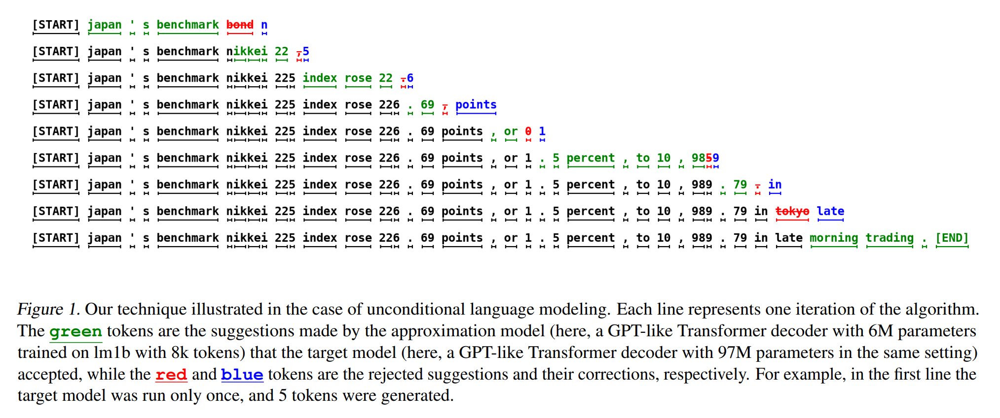
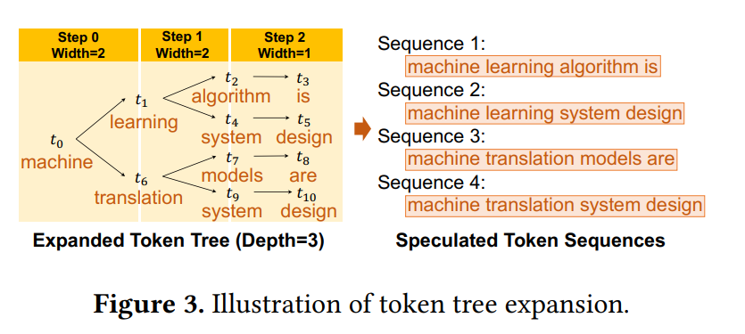
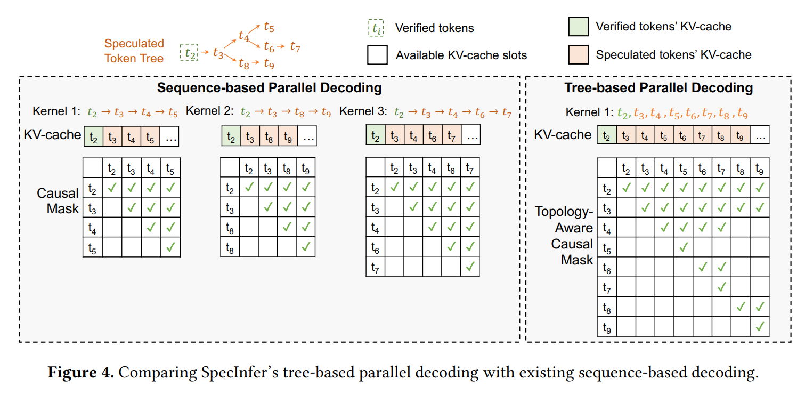
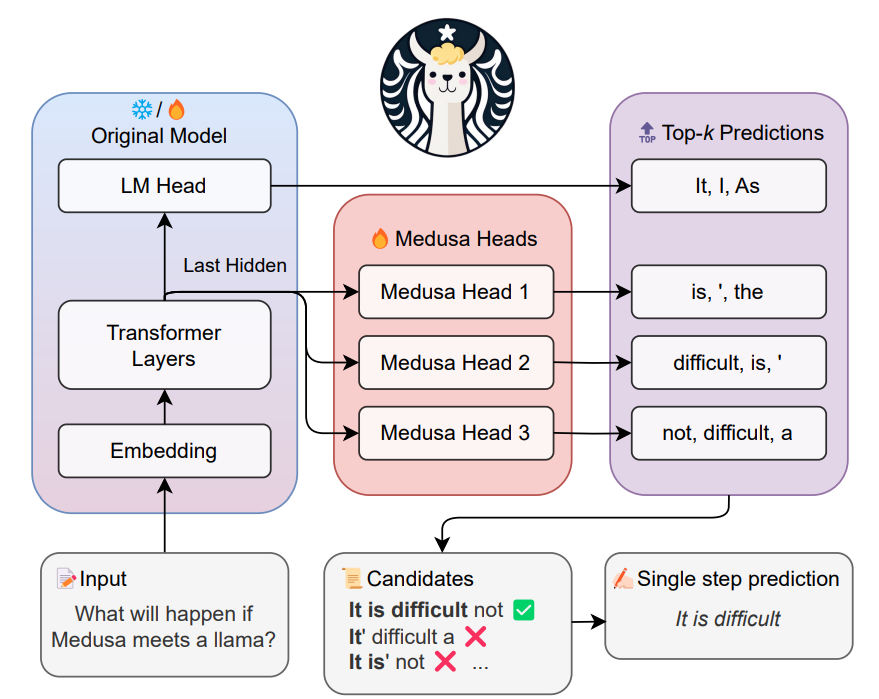
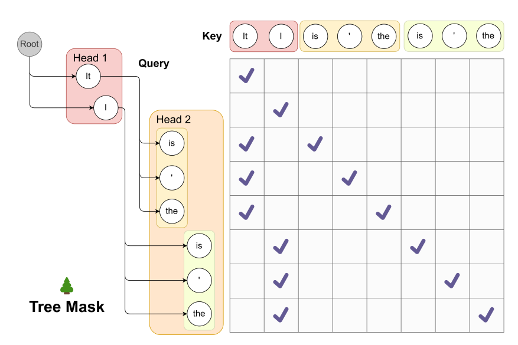

# Lookahead

## 背景
大模型推理分为prefill和decode：
- prefill阶段是compute bound，prompt的所有token可以借助attention_mask进行并行fp；
- decode阶段是memory bound，主要借助kvcache减少冗余计算量，但每次iter只能decode1个token，token间是串行推理，只能通过增大batch提高吞吐；

为了充分利用GPU、NPU等的芯片算力，decode能否也像prefill阶段进行并发前向解码呢？

## 技术路线
### 1. 大小模型投机推理（Speculative Decoding）[<sup>1</sup>](#1)
```
loop：
- 小模型使用对应的prompt作为输入，自回归迭代输出token，循环$N$次输出$N$个token；
- 大模型使用 prompt+decode[0:$N$]做为输入，借助attention_mask做并行解码，输出decode[0:$N$]中每个token对应的logits；
- 比对小模型的decode[0:$N$]和大模型的decode[0:$N$]，如argmax，或kl散度；
- 找出第一个大小模型推理不一致的token，如i，则更新=>prompt=prompt+decode[0:i-1]+decode_t[i]
```
PS：单链的speculative decoding


### 2. Tree Decoding [<sup>2</sup>](#2)<sup>,</sup>[<sup>3</sup>](#3)
- 单个SSM（small speculative model）的token tree的生成（类似beam search）
- 多个SSM，则可利用前缀树合并，或其余方法（如bagging，或boosting等）

- 大模型校验，tree token的所有token合并成一个序列，利用attention_mask进行并行解码；之后与对应step的token进行比对；（隐藏：为了控制多样性，会选择stochastic decoding）


### 3. 多头美杜莎[<sup>4</sup>](#4)
- 相比一般的LM Head，增加多个LM Head去预测 $t+1, t+2, ...,$ 的token（这些head需要训练，可以freeze主干网络）;

- 同样的使用tree-mask，进行并行解码，随后进行校验；


### 4. lookahead


## 进一步优化
### 各技术路线缺点

## 华为实现

## 客户使用


## Ref
<div id="1"></div>

[1][Fast Inference from Transformers via Speculative Decoding](https://arxiv.org/pdf/2211.17192)

<div id="2"></div>

[2][SpecInfer: Accelerating Large Language Model Serving with Tree-based Speculative Inference and Verification](https://arxiv.org/pdf/2305.09781)

<div id="3"></div>

[3][Sequoia: Scalable, Robust, and Hardware-aware Speculative Decoding](https://arxiv.org/pdf/2402.12374)

<div id="4"></div>

[4][MEDUSA: Simple LLM Inference Acceleration Framework with Multiple Decoding Heads](https://arxiv.org/pdf/2401.10774)