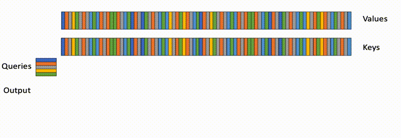

## 入口：
mha_varlen_fwd

## 参数信息问题
```
q，k，v的shape均为[total_q, num_heads, head_size]
```
- dtype为FP16或者BF16;
- total_q就是按照batchsize累加token;
- cu_seqlens_q为每个batch的token数量的前缀和;
- sum_s_q和actual_seqlen_q，分别表示前边的batch一共有多少token，和当前batch有多少token

# 伪算法
### flash-attn-v1


### flash-attn-v2





<table><tr><td bgcolor=yellow><font color="red">PS：batch  和 num_head 是独立并发</font></td></tr></table>

# 怎么使用？
https://github.com/Dao-AILab/flash-attention

## 变长输入
```
flash_attn_unpadded_func -> flash_attn_varlen_func
flash_attn_unpadded_qkvpacked_func -> flash_attn_varlen_qkvpacked_func
flash_attn_unpadded_kvpacked_func -> flash_attn_varlen_kvpacked_func
```

## 固定长输入
```
flash_attn_qkvpacked_func(qkv, dropout_p=0.0, softmax_scale=None, causal=False)
flash_attn_func(q, k, v, dropout_p=0.0, softmax_scale=None, causal=False)
```

## 使用样例

### 关键代码在：flash-attention\flash_attn\flash_attn_interface.py

### FlashSelfAttention
```python
"""Implements the multihead softmax attention.
Arguments
---------
    qkv: The tensor containing the query, key, and value.
        If cu_seqlens is None and max_seqlen is None, then qkv has shape (B, S, 3, H, D).
        If cu_seqlens is not None and max_seqlen is not None, then qkv has shape
        (total, 3, H, D), where total is the sum of the sequence lengths in the batch.
    causal: if passed, will override self.causal
    cu_seqlens: (batch_size + 1,), dtype torch.int32. The cumulative sequence lengths
        of the sequences in the batch, used to index into qkv.
    max_seqlen: int. Maximum sequence length in the batch.
Returns:
--------
    out: (total, H, D) if cu_seqlens is not None and max_seqlen is not None,
        else (B, S, H, D).
"""
flash_attn_varlen_qkvpacked_func(
                qkv,
                cu_seqlens,
                max_seqlen,
                self.drop.p if self.training else 0.0,
                softmax_scale=self.softmax_scale,
                causal=causal,
                alibi_slopes=self.alibi_slopes,
                window_size=self.window_size,
                deterministic=self.deterministic,
            )
```

### FlashCrossAttention(corss atten就是q来自序列1，kv来自序列2)
```python
"""Implements the multihead softmax attention.
Arguments
---------
    q: The tensor containing the query. (B, Sq, H, D)
    kv: The tensor containing the key and value. (B, Sk, 2, H_k, D)
    causal: if passed, will override self.causal
    cu_seqlens: (batch_size + 1,), dtype torch.int32. The cumulative sequence lengths
        of the sequences in the batch, used to index into q.
    max_seqlen: int. Maximum sequence length in the batch of q.
    cu_seqlens_k: (batch_size + 1,), dtype torch.int32. The cumulative sequence lengths
        of the sequences in the batch, used to index into kv.
    max_seqlen_k: int. Maximum sequence length in the batch of k and v.
"""
return flash_attn_varlen_kvpacked_func(
    q,
    kv,
    cu_seqlens,
    cu_seqlens_k,
    max_seqlen,
    max_seqlen_k,
    self.drop.p if self.training else 0.0,
    softmax_scale=self.softmax_scale,
    causal=causal,
    alibi_slopes=self.alibi_slopes,
    window_size=self.window_size,
    deterministic=self.deterministic,
)
```
### flash_attn_with_kvcache
```python
def flash_attn_with_kvcache(
    q,
    k_cache,
    v_cache,
    k=None,
    v=None,
    rotary_cos=None,
    rotary_sin=None,
    cache_seqlens: Optional[Union[(int, torch.Tensor)]] = None,
    cache_batch_idx: Optional[torch.Tensor] = None,
    block_table: Optional[torch.Tensor] = None,
    softmax_scale=None,
    causal=False,
    window_size=(-1, -1),  # -1 means infinite context window
    rotary_interleaved=True,
    alibi_slopes=None,
):
```