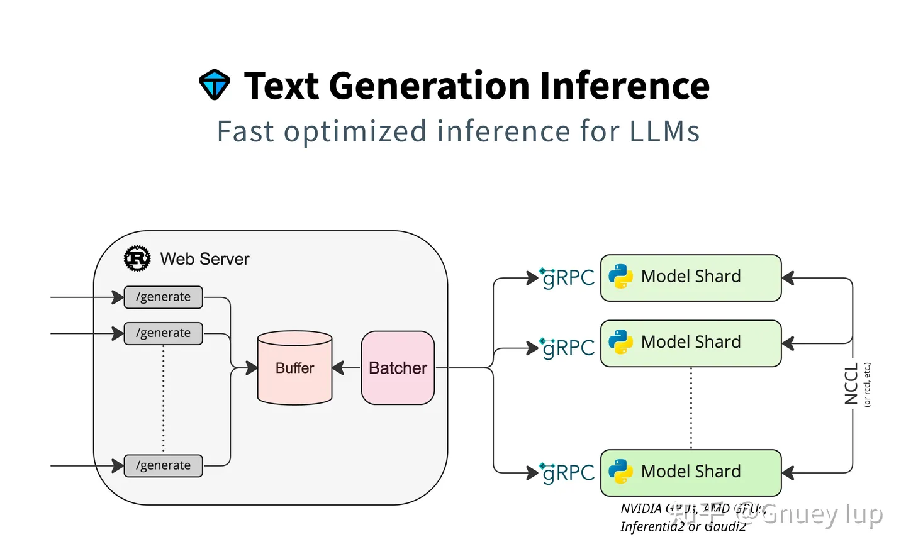
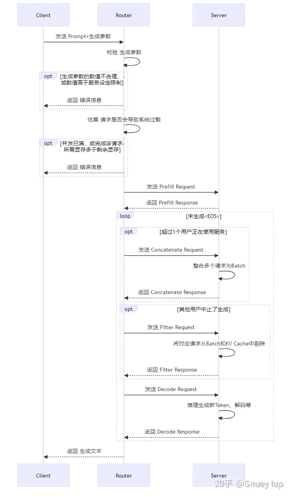
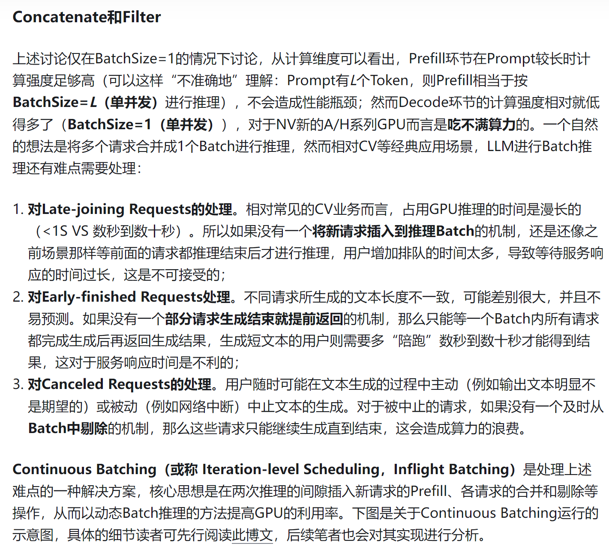

引用自
https://zhuanlan.zhihu.com/p/672925155


# launcher/src/main.rs
1. 参数
```rust
struct Args
```

2. 入口
```rust
fn main()
{
    // Pattern match configuration，解析参数
    ... 
    // Filter events with LOG_LEVEL，log配置
    ...
    // Validate args，校验参数
    ...
    let num_shard = find_num_shards(args.sharded, args.num_shard)?;
    ...
    download_convert_model(&args, running.clone())?;
    ...
    // Start shard processes
    spawn_shards(
        num_shard,
        &args,
        shutdown.clone(),
        &shutdown_receiver,
        shutdown_sender,
        &status_receiver,
        status_sender,
        running.clone(),
    )?;
    ...
    // 1个webserver接受请求；
    spawn_webserver(...);

}
```
- find_num_shards
```rust
fn find_num_shards(
    sharded: Option<bool>,
    num_shard: Option<usize>,
)
{
    ...
    num_cuda_devices();
    ...
}

fn num_cuda_devices() -> Option<usize> {
    let devices = match env::var("ASCEND_RT_VISIBLE_DEVICES") {
        Ok(devices) => devices,
        Err(_) => env::var("NVIDIA_VISIBLE_DEVICES").ok()?,
    };
    let n_devices = devices.split(',').count();
    Some(n_devices)
}
```
- spawn_shards
```rust
fn spawn_shards(...)
{
    ... 
        // 启动线程
        thread::spawn(move || {
            shard_manager(
                model_id,
                revision,
                quantize,
                dtype,
                trust_remote_code,
                uds_path,
                rank,
                num_shard,
                master_addr,
                master_port,
                huggingface_hub_cache,
                weights_cache_override,
                disable_custom_kernels,
                watermark_gamma,
                watermark_delta,
                cuda_memory_fraction,
                otlp_endpoint,
                status_sender,
                shutdown,
                shutdown_sender,
            )
        });
    ...    
    // Wait for shard to start
}

fn shard_manager(...)
{
    ...
        // 对应到 server/pyproject.toml
        let mut p = match Command::new("text-generation-server")
        .args(shard_args)
        .envs(envs)
        .stdout(Stdio::piped())
        .stderr(Stdio::piped())
        .process_group(0)
        .spawn()
    ...
}
```
- webserver
```rust
fn spawn_webserver(
    args: Args,
    shutdown: Arc<AtomicBool>,
    shutdown_receiver: &mpsc::Receiver<()>,
) -> Result<Child, LauncherError> {
    ...
        // router/Cargo.toml
        let mut webserver = match Command::new("text-generation-router")
        .args(router_args)
        .envs(envs)
        .stdout(Stdio::piped())
        .stderr(Stdio::piped())
        .process_group(0)
        .spawn()
    ...
}
```  

# Command::new("text-generation-server")
创建model server
```python
## text-generation-inference/server/text_generation_server/server.py
def serve(
        model_id: str,
        revision: Optional[str],
        sharded: bool,
        quantize: Optional[str],
        dtype: Optional[str],
        trust_remote_code: bool,
        uds_path: Path,
):
    async def serve_inner(
            model_id: str,
            revision: Optional[str],
            sharded: bool = False,
            quantize: Optional[str] = None,
            dtype: Optional[str] = None,
            trust_remote_code: bool = False,
    ):
        ...
            model = get_model(
                model_id, revision, sharded, quantize, dtype, trust_remote_code
            )
        ...        


```

# Router
- 多个sharded（model server），单个router（做路由分发）
- text-generation-inference/router/src/main.rs
```rust
fn main() -> Result<(), RouterError> {
    ...
    // Validate args
    ...
    let tokenizer = if local_model {
        // Load local tokenizer
        Tokenizer::from_file(local_path.join("tokenizer.json")).ok()
    } else {
        // Download and instantiate tokenizer
        // We need to download it outside of the Tokio runtime
        let params = FromPretrainedParameters {
            revision: revision.clone().unwrap_or("main".to_string()),
            auth_token: authorization_token.clone(),
            ..Default::default()
        };
        Tokenizer::from_pretrained(tokenizer_name.clone(), Some(params)).ok()
    };
    ...
    // 起异步线程客户端，去请求text-generation-server起的服务
    // Launch Tokio runtime
    tokio::runtime::Builder::new_multi_thread()
        .enable_all()
        .build()?
        .block_on(async {
            ...
            // Instantiate sharded client from the master unix socket
            // ShardedClient -> Vec<Client> -> TextGenerationServiceClient
            // 调用 text-generation-inference/server/text_generation_server/server.py
            let mut sharded_client = ShardedClient::connect_uds(master_shard_uds_path)
                .await
                .map_err(RouterError::Connection)?;
            ...

        });   
    ...
            // 计算最大支持的token数；
            let max_supported_batch_total_tokens = match sharded_client
                .warmup(max_input_length as u32, max_batch_prefill_tokens)
                .await
                .map_err(RouterError::Warmup)?
    ...     
            // Run server
            server::run(...);        
}

```

- router/server.rs
```rust
pub async fn run(...)
{
    ...
    // 实际infer对象；
    let infer = Infer::new(
        client,
        validation,
        waiting_served_ratio,
        max_batch_prefill_tokens,
        max_batch_total_tokens,
        max_waiting_tokens,
        max_concurrent_requests,
        shard_info.requires_padding,
        generation_health,
    );   
    ...
    // Create router 服务
    let app = Router::new()
        .merge(SwaggerUi::new("/docs").url("/api-doc/openapi.json", ApiDoc::openapi()))
        // Base routes
        .route("/", post(compat_generate))
        .route("/info", get(get_model_info))
        .route("/generate", post(generate))
        .route("/generate_stream", post(generate_stream))
        // AWS Sagemaker route
        .route("/invocations", post(compat_generate))
        // Base Health route
        .route("/health", get(health))
        // Inference API health route
        .route("/", get(health))
        // AWS Sagemaker health route
        .route("/ping", get(health))
        // Prometheus metrics route
        .route("/metrics", get(metrics))
        .layer(Extension(info))
        .layer(Extension(health_ext.clone()))
        .layer(Extension(compat_return_full_text))
        .layer(Extension(infer))
        .layer(Extension(prom_handle.clone()))
        .layer(opentelemetry_tracing_layer())
        .layer(cors_layer);     
}
```

## infer.rs
```rust
impl Infer {
    #[allow(clippy::too_many_arguments)]
    pub(crate) fn new(
        client: ShardedClient,
        validation: Validation,
        waiting_served_ratio: f32,
        max_batch_prefill_tokens: u32,
        max_batch_total_tokens: u32,
        max_waiting_tokens: usize,
        max_concurrent_requests: usize,
        requires_padding: bool,
        generation_health: Arc<AtomicBool>,
    ) -> Self {
        ...
        // Spawn batching background task that contains all the inference logic
        tokio::spawn(batching_task(
            client,
            waiting_served_ratio,
            max_batch_prefill_tokens,
            max_batch_total_tokens,
            max_waiting_tokens,
            queue.clone(),
            shared.clone(),
            generation_health,
        ));
        ...        
    }
}

async fn batching_task(
    mut client: ShardedClient,
    waiting_served_ratio: f32,
    max_batch_prefill_tokens: u32,
    max_batch_total_tokens: u32,
    max_waiting_tokens: usize,
    queue: Queue,
    shared: Arc<Shared>,
    generation_health: Arc<AtomicBool>,
) {
    loop {
        ...
        
        ...
    }
}
```

- warmup 做了什么，怎么计算最大支持token数；
