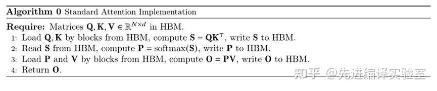
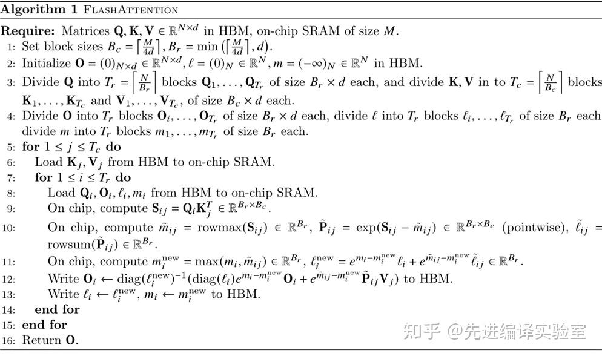
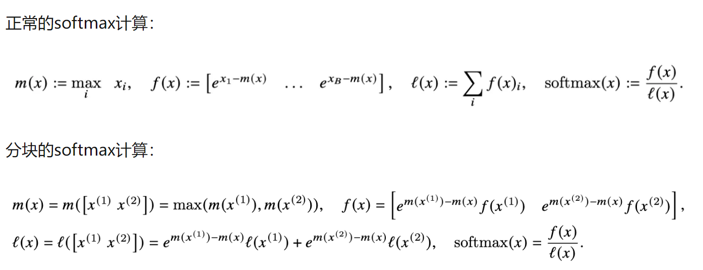
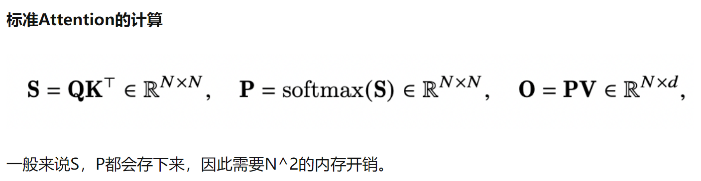

# 目的
减少HBM的使用

# 传统Attention 算法流程
  - 算法流程

# Flash Attention 算法流程
  - 算法流程

  - 自我理解
    1. 参数 $Q, K, V \in R^{N \times d}$，SRAM size $M$。
    2. 设置block大小为，$B_c=\lceil\frac{M}{4d}\rceil,B_r=\min(\lceil\frac{M}{4d}\rceil,d)$.
    3. - $O=(0)_{N \times d} \in R^{N \times d}$, 
       - $l=(0)_N \in R^N$, 
       - $m=(-\infin)_N \in R^N$
    4. - 将$Q$切分为 $T_r = \lceil\frac{N}{B_r}\rceil$ blocks, $Q_1,Q_2,.... \in R^{B_r \times d}$，
       - $K,V$切成$T_c=\lceil\frac{N}{B_c}\rceil$ blocks, $K_1, K_2, ..., K_{T_C}$ and $V_1, V_2, V_{T_C} \in R^{B_C \times d}$
    5. - 把$O$切成$T_r$ blocks, $O_1,O_2,.... \in R^{B_r \times d}$, 
       - 把$l$切成$T_r$ blocks, $l_1,l_2,.... \in R^{B_r}$, 
       - 把$m$切成$T_r$ blocks, $m_1,m_2,.... \in R^{B_r}$;
  
    6. 公式
      - 
      - 注意：
        - $f(x^{(1)}) = [e^{x_1^{(1)} - m(x^{(1)})}, e^{x_2^{(1)} - m(x^{(1)})}, ...]$
        - 所以$e^{m(x^{(1)})-m(x)}f(x^{(1)}) = [e^{x_1^{(1)} - m(x)}, e^{x_2^{(1)} - m(x)}, ...]$
    7. [算法流程](#算法流程) 的12行，代表增量更新$PV$
       - 