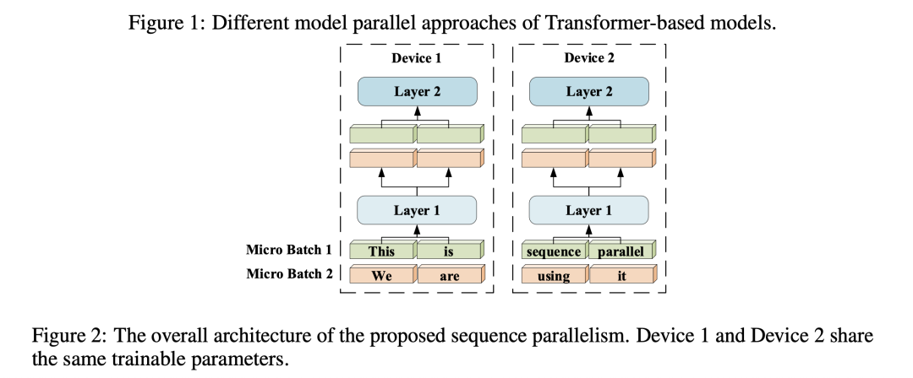
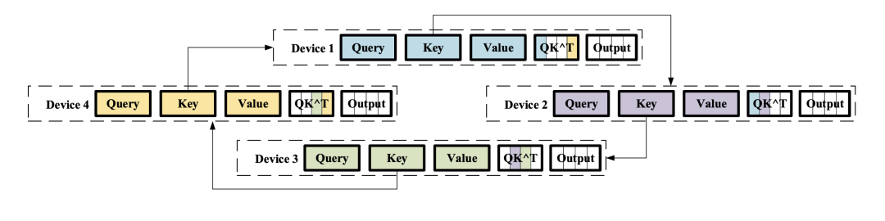
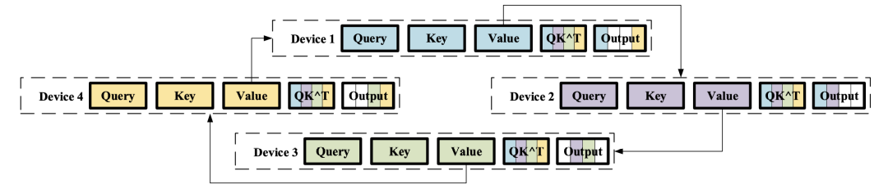

# Sequence Parallelism



## PS
- 每个device上有完整的模型权重，和不同的子序列；


# MLP的Sequence-Parallelism
```
dense1 = nn.Linear(H, 4H)
dense2 = nn.Linear(4H, H)
```
- N为设备数；

1. 第一层全连接，输入会从 $(B, L, H)$ 变为 $(B, \frac{L}{N}, H)$，参数量为$(H, 4H)$，输出为$(B, \frac{L}{N}, 4H)$;
2. 第二层全连接，参数量为$(4H, H)$，输出为$(B, \frac{L}{N}, H)$;
3. 总计显存占用为，
   - 全连接层参数量$4H*H*2$；
   - 梯度参数量（以adam为例）：梯度$4H*H*2$
   - adam参数$\alpha + \beta = 2 * 4H*H * 2$
   - 第一层激活，$\frac{4BLH}{N}$ 
   - 第二层激活，$\frac{BLH}{N}$
   - total: $8H^2+8H^2+16H^2+\frac{5BLH}{N}=32H^2+\frac{5BLH}{N}$

# Self-Attention的Sequence-Parallelism
- 基于ring-all-reduce算法（先scatter-reduce，再all-gather）

## ring-self-attention
### ring传输key值
  

我们以计算Q, K为例，在第一个iter中：
- Device1接收了Device4上的Key，计算了Device1，Device4的${QK}_1$
- Device2接收了Device1上的Key，计算了Device2，Device1的${QK}_2$
- Device3接收了Device2上的Key，计算了Device3，Device2的${QK}_3$
- Device4接收了Device3上的Key，计算了Device4，Device3的${QK}_4$

### ring传输value值
  
- $Q$ 不需要传，输出只与当前$Q$相关；

