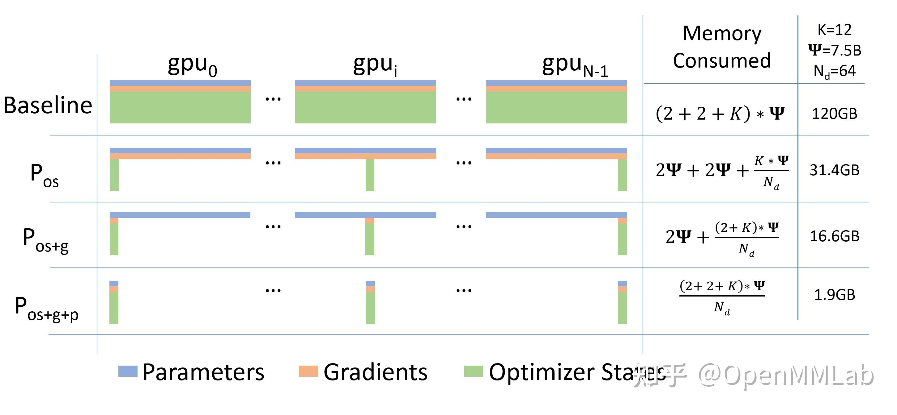
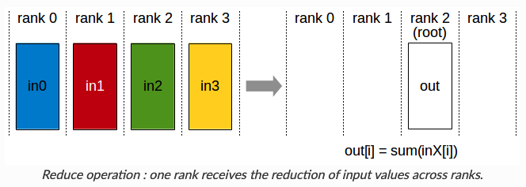
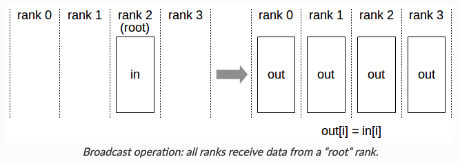
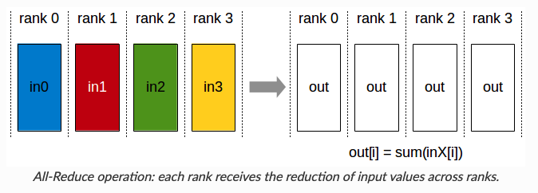
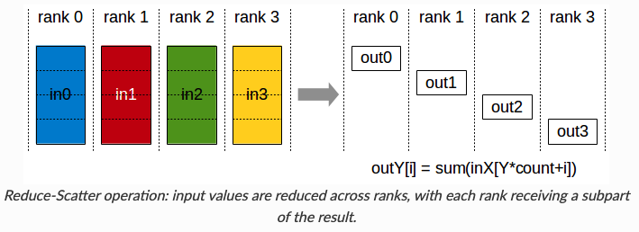
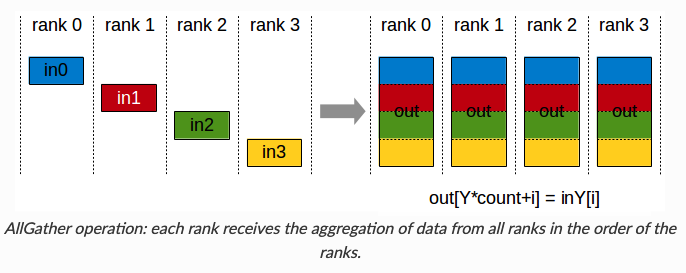
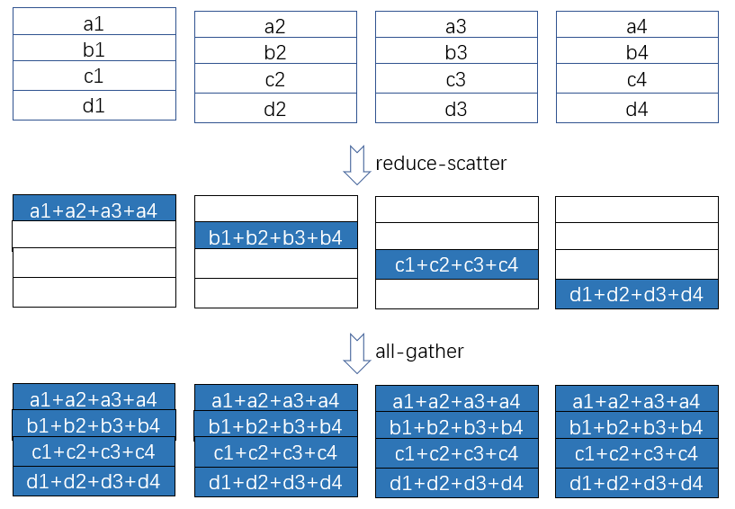

**主要应用于数据并行，减少数据冗余；**

- [Model State组成](#model-state组成)
  - [Optimizer State](#optimizer-state)
  - [Gradient](#gradient)
  - [Model Parameter](#model-parameter)
  - [参数更新过程](#参数更新过程)
- [Zero级别](#zero级别)
  - [Zero-1](#zero-1)
  - [Zero-2](#zero-2)
- [附录](#附录)
  - [Reduce](#reduce)
  - [Broadcast](#broadcast)
  - [All-Reduce](#all-reduce)
  - [Reduce-Scatter](#reduce-scatter)
  - [All-Gather](#all-gather)
  - [Ring All Reduce](#ring-all-reduce)

# Model State组成
**DP=1, 以FP16计算，模型参数量为$\phi$，则单模型训练需占用内存=$12\phi+2\phi+2\phi$** 
**例如：7.5B模型训练时占用内存$\approx16*7.5=120GB$**
## Optimizer State
  - FP32, 模型参数副本
  - FP32, Adam 的参数，momentum 和 Variance
## Gradient
  - FP16，模型反向梯度
## Model Parameter
  - FP16，模型参数
## 参数更新过程

# Zero级别

## Zero-1
1. 前向和后向不涉及$Optimizer_State$，所以可以更新完与之对应的一小段参数后，再把各个小段拼起来合为完整的模型参数
<video id="video" controls="" preload="none" poster="封面">
<source id="mp4" src="../Video/Zero-1.mp4" type="video/mp4"></source>
</video>

2. 更新过后的Partitioned FP32 Master Parameters会通过All-gather传回到各个进程中, 完成一次完整的参数更新;

## Zero-2

# 附录
## Reduce

## Broadcast

## All-Reduce

## Reduce-Scatter

## All-Gather

## Ring All Reduce

