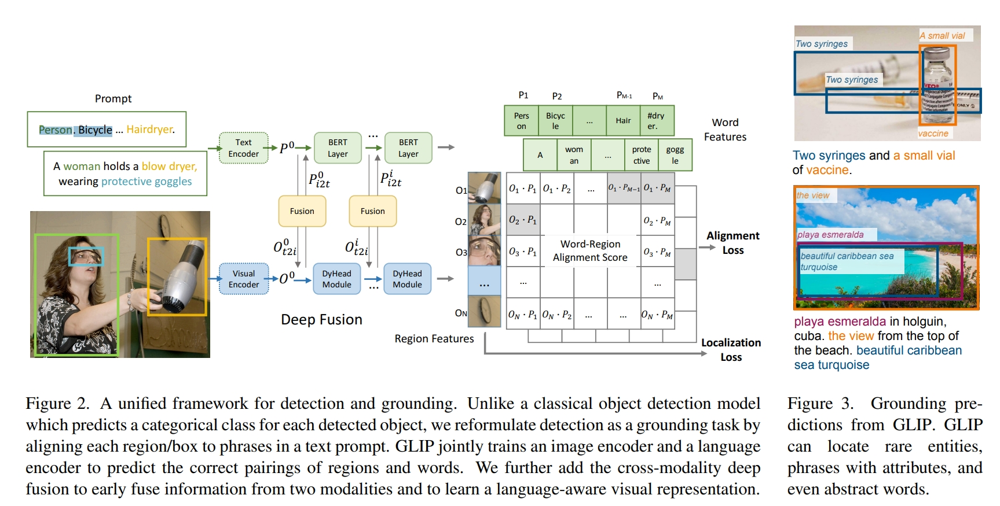
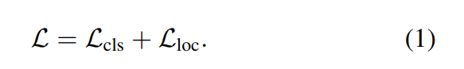
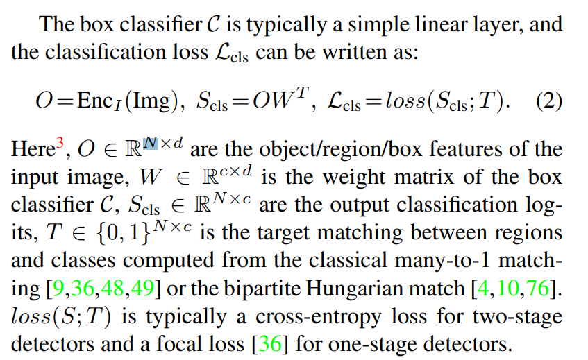
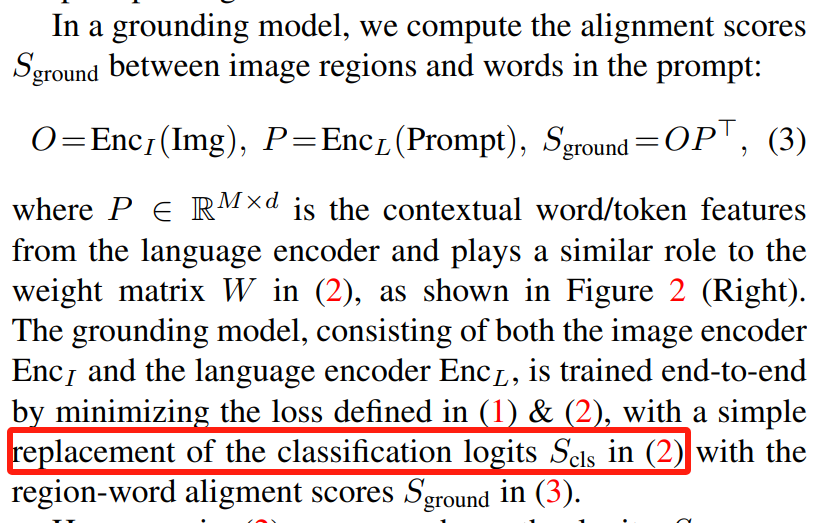

# GLIP
## 背景内容参考[DeformableConv](./deformable.md)
## 结构


## 论文详读
### 攻击点：
1. 只能识别predifined的类别；
2. scale up很costly；

### Abstract
- 融合了img feature和prompt feature
- 既能提升detec的能力，又能提升grounding的能力
- img representation更具语义性
- 同时在zero-shot、few-shot上能力更强
- 一堆实验数据blabla

### Intro
- clip image-level的visual representation富有语义性；
- 提出使object-level的visual representation富有语义性；
```
object-level
language-aware
semantic-rich
```
- 介绍phrase grounding
  - word-to-region matching

- Unifying detection and grounding by reformulating object detection as phrase grounding.
  - 使用image和prompt作为输入（其中prompt为所有的类别名）
  - 每层fuse text-feat & object-feat
- Scaling up visual concepts with massive image-text data. 
  - 用训练好的 grounding model生成 image-text pair（没看太懂）
  - 数据增强
- Transfer learning with GLIP
  - 泛化能力强

### Related 
1. 反复在讲CLIP，并且提到有scalable and semantic-rich grounding data可以用。

### Method
#### 传统od模型
- loss 

- Img Feature
  - 
- Text Feature（替换$S_{cls}$）
  - 
- $S_{cls}$ 和 $S_{ground}$ shape不一致，$M >> c$;
  - 推理时，average sub-word