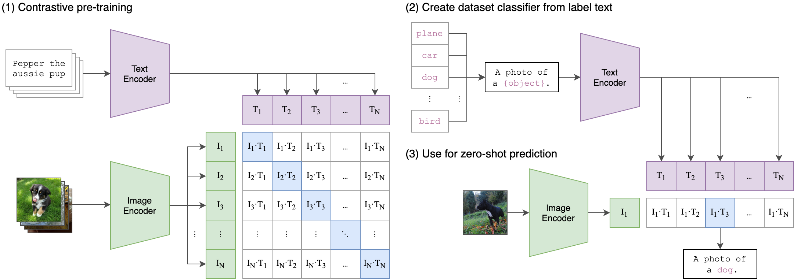

# 一图胜千文

1. 左侧为训练，matmul出来的矩阵，对角线为正样本，其余为batch内负样本；
2. 右侧为推理，把所有的类别按格式组成prompt，计算matmul后的sim，取最大的sim对应的类别为输出；

# 总体
1. 获取模型配置
```python
model_cfg = model_cfg or get_model_config(model_name)
```
2. _rescan_model_configs，启动时会扫描所有的json文件；
3. 创建模型
```python
model = CLIP(**model_cfg, cast_dtype=cast_dtype)
```
4. 对应的配置文件在 “open_clip\src\open_clip\model_configs”

# quick_gelu
$$
x*sigmoid(1.702*x)
$$

# image encoder
```python
self.visual = _build_vision_tower(embed_dim, vision_cfg, quick_gelu, cast_dtype)
```
vision_tower结构详见<br>
“LLM-Notebook\Model\CV\OpenClip\openclip-vision-tower.drawio”

# text encoder
```python
text = _build_text_tower(embed_dim, text_cfg, quick_gelu, cast_dtype)
```
类似visio-tower，除了加上casual_mask

# Training
## Loss
```python
    total_loss = (
        F.cross_entropy(logits_per_image, labels) +
        F.cross_entropy(logits_per_text, labels)
    ) / 2
```