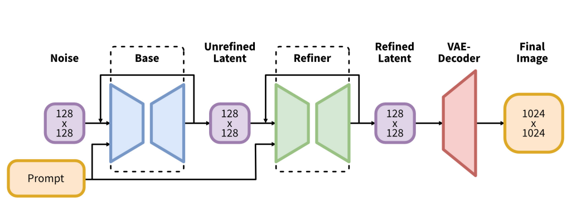
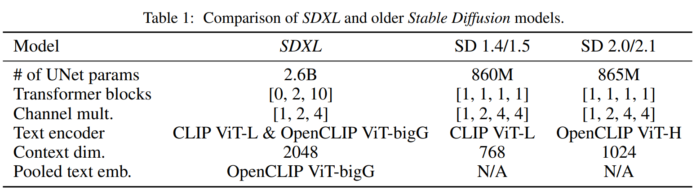
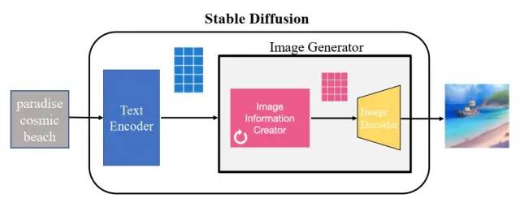
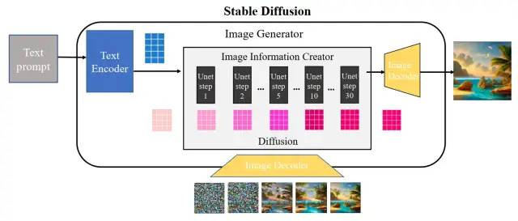
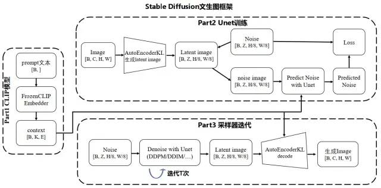
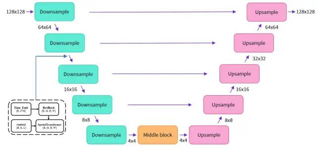
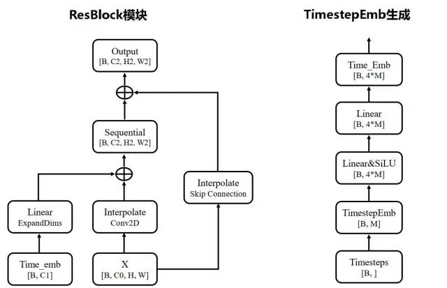
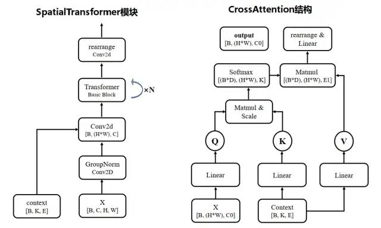

# Stable Diffusion 讲解
三大部分
# U-Net
# VAE
# CLIP Text Encoder
# Cascade Model
SDXL base和SDXL refiner
- SDXL Base模型由U-Net、VAE以及CLIP Text Encoder（两个）三个模块组成
- SDXL Refiner模型同样由U-Net、VAE和CLIP Text Encoder（一个）三个模块组成

# SDXL模型结构

# 各版本模型比对

# Ref
[深入浅出完整解析Stable Diffusion XL（SDXL）核心基础知识](https://zhuanlan.zhihu.com/p/643420260)
[十分钟读懂Stable Diffusion运行原理](https://www.cnblogs.com/88223100/p/Principle-of-Stable-Diffusion-Operation.html)

# stable diffusion 原理

## 文本编码器（蓝色模块）
如clip text部分

## 图片信息生成器（粉色模块）
- 图片信息生成器的输入输出均为低维图片向量，注：是低维向量，不是原始图片；
- 图片信息生成器里由一个 Unet 网络和一个采样器算法共同完成
- 循环去噪

## 图片解码器（黄色模块）
- upsample

## infer时，是逆向扩散；train，是正向扩散；

# SD 详细框架

## 训练
1. image downsample:  
   a. 用 AutoEncoderKL 自编码器把输入图片从像素空间映射到隐向量空间，把 RGB 图片转换到隐式向量表； 
   b. 在训练 Unet 时自编码器参数已经训练好和固定的;

2. text encoding:
   a. 用 FrozenCLIPEmbedder 文本编码器来编码输入提示词 Prompt，生成向量表示 context;
   
3. 加噪声，预测噪声
   a. 对输入图像的隐式向量施加不同强度噪声，再把加噪后隐向量输入到 UNetModel 来输出预估噪声，和真实噪声信息标签作比较来计算 KL 散度 loss，并通过反向传播算法更新 UNetModel 模型参数；引入文本向量 context 后，UNetModel 在训练时把其作为 condition，利用注意力机制来更好地引导图像往文本向量方向生成；

## 推理
1. 用 FrozenCLIPEmbedder 文本编码器把输入提示词 Prompt 进行编码，生成维度为[B, K, E]的向量表示 context，与训练阶段的第 2 步一致；

2. 利用随机种子随机产出固定维度的噪声隐空间向量，利用训练好的 UNetModel 模型，结合不同采样器（如 DDPM/DDIM/PLMS）迭代 T 次不断去除噪声，得到具有文本信息的隐向量表征；

3. 用 AutoEncoderKL 自编码器把上面得到的图像隐向量进行解码，得到被映射到像素空间的生成图像。

## UNet

### 输入：
- 图像表示，用隐空间向量输入的维度为[B, Z, H/8, W/8]；
-  timesteps 值，维度为[B, ]；
-  文本向量表示 context，维度为[B, K, E]；
  
### 流程
1. 先经过ResBlock和SpatialTransformer；
2. 再进行upSample和downSample；

### ResBlock

### Spatial Transformer

