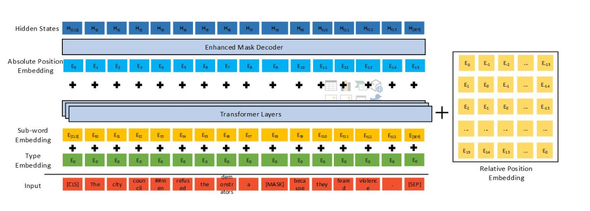
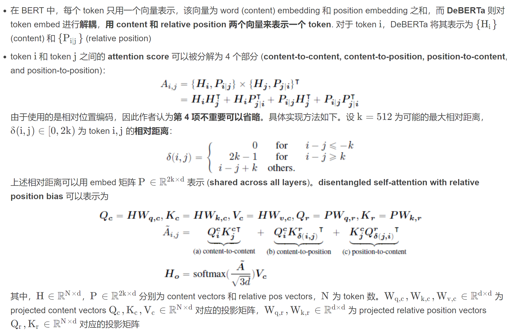

# Roberta VS Bert
- 更大的参数量
- 更大的batchSize
- 更多的数据
- 去掉NSP任务（Next Sentence Prediction）
- 动态掩码（bert预处理执行一次掩码，后固定）
- encoding，BPE

# Deberta VS Bert

- Disentangled Attention，将bert中原本的简单总和 -> 分为content embedding 和 position embedding；
  
- Absolute Position
  - 为了弥补 absolute position 信息，DeBERTa 在做 masked token prediction 时直接将 absolute word position embeddings 加到了 softmax 前 (softmax 用于在 MLM 中输出 masked token 为各个单词的概率)
- SiFT
  - 在 NLP 任务中，对抗训练通常是加在 word embedding 上，然而，不同 token 对应的 word embedding 的 norm 各不相同，并且模型参数越大 norm 的方差也就越大，这会使得训练过程不稳定。为此，SiFT 先将 word embeddings 归一化为概率向量，然后在归一化的 word embeddings 上添加扰动

# Deberta V2
- Larger Vocabulary
- nGiE，uses an additional convolution layer aside with the first transformer layer to better learn the local dependency of input tokens.
- Sharing position projection matrix with content projection matrix in attention layer
- Apply bucket to encode relative positions
- 2 additional model size

# Deberta V3
- RTD, 类似GAN
- GDES, Generator和discriminator共享token embedding