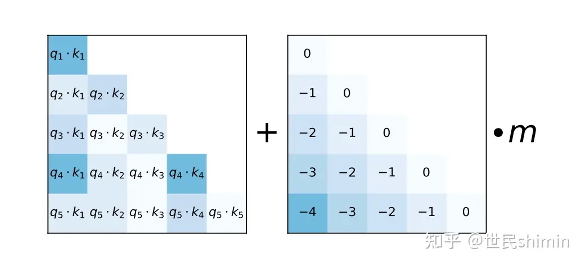

# Training
```
slopes = torch.Tensor(_get_interleave(self.n_head))
```

- 如果$n\_head$是2的指数幂
$$
start = ratio = 2^{-(2^{-(log_2^n - 3)})}
\\
slopes = [ratio^1, ratio^2,..., ratio^n]
$$
- 如果$n\_head$是非2的指数幂
$$
n = 2^{\lfloor log_2^n \rfloor}
$$
``` python
_get_interleave_power_of_2(closest_power_of_2)
            + _get_interleave(2 * closest_power_of_2)[0::2][: n - closest_power_of_2]
```


