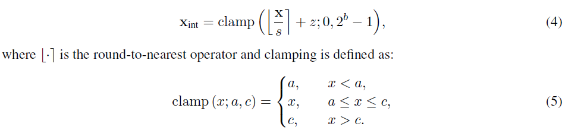
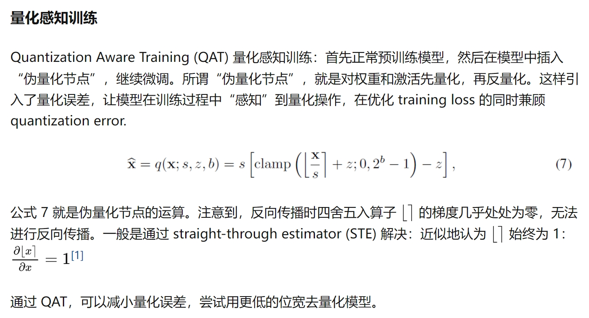

# 量化三要素
- 量化位宽 $b$
- 量化系数 $s$
- 零点 $z$

## 非对称量化

## 对称量化

 
# QAT (量化感知训练)

# PTQ（训练后量化）
## 动态量化
- 实时计算量化系数
  
## 静态量化
- 准备一些有代表性的数据（称为“校准数据”），送入模型，计算每一层激活的统计量；利用这些统计量（主要是最大值）计算量化系数

# 量化粒度
LLM.int8(), SmoothQuant, GPT-Q， AWQ

