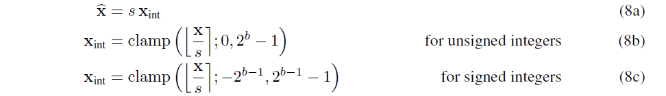

# 量化三要素
- 量化位宽 $b$
- 量化系数 $s$
- 零点 $z$

## 非对称量化

## 对称量化

 
# QAT (量化感知训练)

# PTQ（训练后量化）
## 动态量化
- 实时计算量化系数
  
## 静态量化
- 准备一些有代表性的数据（称为“校准数据”），送入模型，计算每一层激活的统计量；利用这些统计量（主要是最大值）计算量化系数

# 量化粒度
LLM.int8(), SmoothQuant, GPT-Q， AWQ

# OBS量化
[link](https://www.cnblogs.com/wangbingbing/p/17547681.html)
1. 泰勒展开式
$$
p(x)=p(0)+p'(0)x+\frac{1}{2}p''(0)x^2+...+\frac{1}{n!}p^{(n)}(0)x^n+o(x^n) \tag{1} 
$$
2. 多元函数2阶展开
$$
E(W)=E(W_0)+(\frac{\partial E}{\partial W})^T\cdot (W-W_0)+\frac{1}{2}(W-W_0)^T\cdot \mathbf{H}\cdot (W-W_0)+o(||W-W_0||^3)
\\
E(W)-E(W_0)=(\frac{\partial E}{\partial W})^T\cdot (W-W_0)+\frac{1}{2}(W-W_0)^T\cdot \mathbf{H}\cdot (W-W_0)+o(||W-W_0||^3)
$$
   - 把$E(W)-E(W_0)$用$\delta E$代替，得到：
$$
\delta E=(\frac{\partial E}{\partial W})^T\cdot \delta W+\frac{1}{2}\delta W^T\cdot \mathbf{H}\cdot \delta W+o(||\delta W||^3)
$$
3. 多元函数泰勒展开
   
   - 于是 $\frac{1}{2}\delta W^T\cdot \mathbf{H}\cdot \delta W$可转为${\frac {1}{2}}\sum_{i=1}^n (\Delta x_i)^2G_{ii} +{\frac {1}{2}} \sum_{i!=j} \Delta x_i \Delta x_jG_{ij}$
   
4. 使$L_q$最小化，获得$w_q$即为可剪枝权重；
$$
\begin{align*}

\delta W&=-\frac{w_q}{\mathbf{H}^{-1}_{qq}}\mathbf{H}^{-1}\cdot e_q \\
&=-\frac{w_q}{\mathbf{H}^{-1}_{qq}}\mathbf{H}^{-1}_{:,q}
\\
L_q&=\frac{1}{2}\frac{w_q^2}{\mathbf{H}^{-1}_{qq}}
\end{align*}
$$

# OBQ量化
1. 分组量化

# GPTQ

# LLM.int8
1. 分成2块量化，重要的不量化，不重要的量化；

# awq

# smoothquant

