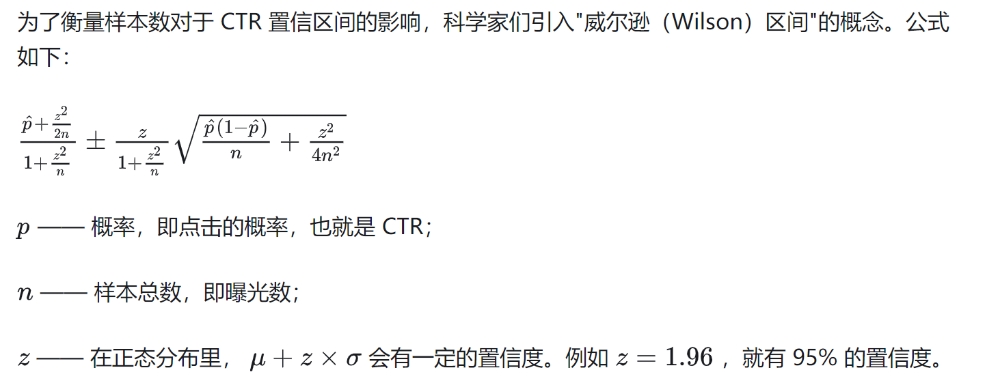

# wilson ctr
- 曝光低的 item，大概率是你精准投放人群导致的，并不满足 wilson ctr 随机投放的基本假设。
- 确切来说，我们要分人群去统计相对的 ctr，消除投放人群的 bias。

## 定义&公式


```python
import numpy as np

def walson_ctr(num_click, num_pv, z=1.96):
    p = num_click * 1.0 / num_pv
    if p > 0.9:
        return 0.0
    
    n = num_pv
    
    A = p + z**2 / (2*n)
    B = np.sqrt(p * (1-p) / n + z**2 / (4*(n**2)))
    C = z * B
    
    D = 1 + z**2 / n

    ctr = (A - C) / D
    
    return ctr
```

## 解决方法
- 高热 item 的点击率和投放人群的关系不是很大，几乎人人都会点，可以作为 CTR 本底。扣除这种 ctr 表示，相比大众货，用户更喜欢点那些 item，用这种相对的 ctr 作为 item 热度的衡量
