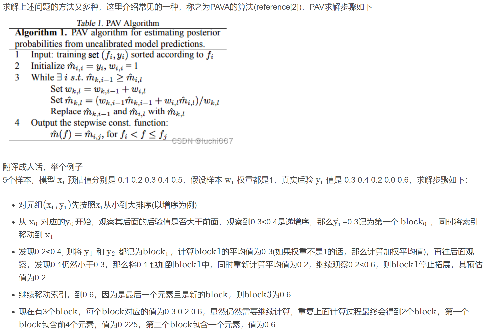

# Calibration

ref-link: https://zhuanlan.zhihu.com/p/142086309

## 基本原则
- 矫正的结果不能改变测试数据的 ctr 序, 即 Calibration 要保持单调性(Calibration 前后的 AUC 保持不变)。
- 矫正的目的是在 ctr 序的分桶上 COPC 接近1。(Calibration只矫正 ctr 序上的有偏，特征级别的有偏需要在特征级别进行矫正。)

## 负采样矫准
- 原因：负采样，导致预估值偏高；
### 矫正方式一
- $p'$: 采样后预测概率
- $p$: 未采样的预测概率
- $N_p$: 正样本数量
- $N_n$: 采样后负样本数量
- $r$: 负采样比例
$$
\frac{p'}{1-p'} = \frac{N_p}{N_n}
\\
\frac{p}{1-p} = \frac{N_p}{\frac{N_n}{r}}
\\
p'= sigmoid(wx)=\frac{1}{1+e^{-wx}}
$$
推导出
$$
p = \frac{1}{1+e^{-(wx+ln(r))}}
$$

## 保序回归矫准
[link](https://blog.csdn.net/u010223750/article/details/123159213?ops_request_misc=%257B%2522request%255Fid%2522%253A%2522171619214116800226518082%2522%252C%2522scm%2522%253A%252220140713.130102334..%2522%257D&request_id=171619214116800226518082&biz_id=0&utm_medium=distribute.pc_search_result.none-task-blog-2~all~sobaiduend~default-1-123159213-null-null.142^v100^pc_search_result_base6&utm_term=%E6%A8%A1%E5%9E%8B%E7%BA%A0%E5%81%8F%E4%B9%8B%E4%BF%9D%E5%BA%8F%E5%9B%9E%E5%BD%92&spm=1018.2226.3001.4187)

- PAVA算法

