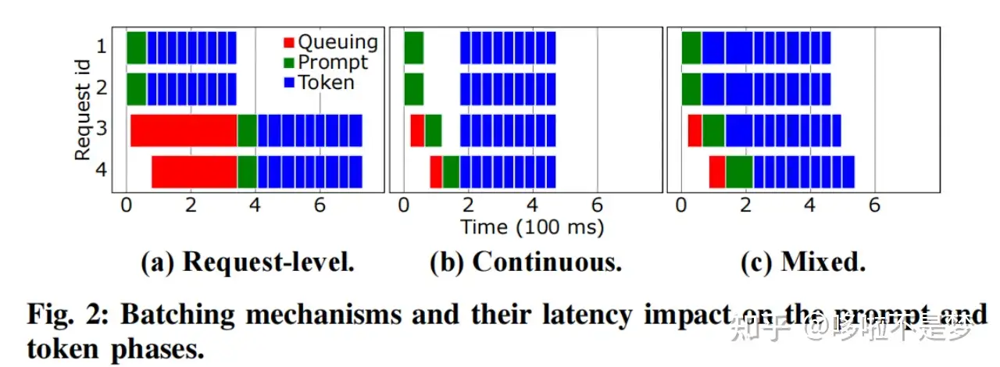

#! https://zhuanlan.zhihu.com/p/707757424
# Position Embedding详解
（未完成，持续补全中）

## 背景
1. 加入位置信息，如果没有位置编码，举例：
   $$
   Sim(x_m, x_n) = Sim(x_m, x_{n+t}) \\
   if \space x_n = x_{n+t}
   $$
即使$t$非常大，显然不合理；（同样的词，不同的相对间距，相似度应该是不一致的）

## 位置编码种类
### 绝对位置编码
$$
Y = W(x_t+pos_t) + b \\
pos_{t, 2i} =sim(\frac{t}{10000^{\frac{2i}{d}}}) \\ 
 \\
pos_{t, 2i+1} =cos(\frac{t}{10000^{\frac{2i}{d}}}) \\
d为向量维度
$$

### 相对位置编码
1. T5相对位置编码[1](#1)
$$
A_{s,t} = q_s^T \times k_t + r_{b(t-s)} \\
b()为函数 \\
r为对应位置的数值
$$

2. ALiBi[3](#3)

- 计算softmax前对$qk$乘积增加不可学习的bias；
$$
softmax(q_iK^T+m·[-(i-1),...,-2,-1,0]) \\
$$
- 不同的head的 $m$ 也是不一样
$$
m = 2^{\frac{-8}{n} \times [0,1,2,...,n]} \\
n 为head的数量
$$

1. Rope[2](#2)
根据余弦和的定义
$$
A_{s,t}=x_t^TW_Q^TR_{\theta, s}R_{\theta, t}^dW_Kx_s=x_t^TW_Q^TR_{\theta, s-t}^dW_Kx_s \\
$$
$$
R_{\theta, t}^d=\left[
    \begin{matrix}
    cost{\theta}_1 & -sint{\theta}_1 & ... & 0   & 0   \\
    sint{\theta}_1 & cost{\theta}_1  & ... & 0   & 0   \\
    ...            & ...             & ... & 0   & 0   \\
    ...            & ...             & ... & ... & ... \\
    ...            & ...             & ... & cost{\theta}_{\frac{d}{2}} & -sint{\theta}_{\frac{d}{2}} \\
    ...            & ...             & ... & sint{\theta}_{\frac{d}{2}} & cost{\theta}_{\frac{d}{2}} 
    \end{matrix}
\right] \\
$$
$$
{\theta}_n = \frac{1}{10000^{\frac{2(n-1)}{d}}}
$$

$$
R_{\theta, t}^dx_t=\left(\begin{matrix}
x_{t,0} \\
x_{t,1} \\
x_{t,2} \\
x_{t,3} \\
...\\
x_{t,d-2} \\
x_{t,d-1} \\
  \end{matrix}\right) \left(\begin{matrix}
cost{\theta}_{0} \\
cost{\theta}_{0} \\
cost{\theta}_{1} \\
cost{\theta}_{1} \\
...\\
cost{\theta}_{\frac{d}{2}-1} \\
cost{\theta}_{\frac{d}{2}-1} \\
  \end{matrix}\right) + \left(\begin{matrix}
-x_{t,1} \\
x_{t,0} \\
-x_{t,3} \\
x_{t,2} \\
...\\
-x_{t,d-1} \\
x_{t,d-2} \\
  \end{matrix}\right) \left(\begin{matrix}
sint{\theta}_{0} \\
sint{\theta}_{0} \\
sint{\theta}_{1} \\
sint{\theta}_{1} \\
...\\
sint{\theta}_{\frac{d}{2}-1} \\
sint{\theta}_{\frac{d}{2}-1} \\
  \end{matrix}\right)
$$

## 优缺点
后续补充

## 额外特性
后续补充

### 外推性
后续补充
（怎么做，原理是什么）

## Ref

[1][Exploring the Limits of Transfer Learning with a Unified Text-to-Text Transformer](https://arxiv.org/pdf/1910.10683v3)

[2][ROFORMER: ENHANCED TRANSFORMER WITH ROTARY POSITION EMBEDDING](https://arxiv.org/pdf/2104.09864)

[3][TRAIN SHORT, TEST LONG: ATTENTION WITH LINEAR BIASES ENABLES INPUT LENGTH EXTRAPOLATION](https://arxiv.org/pdf/2108.12409)

